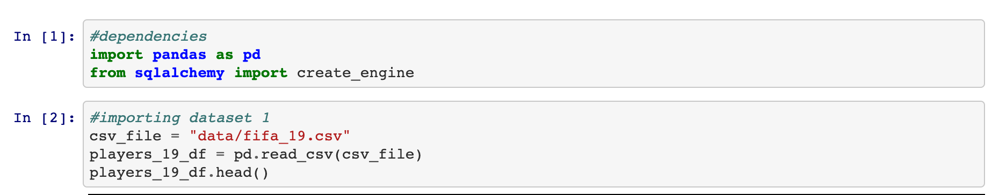
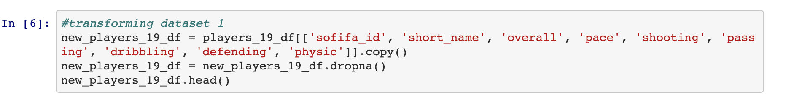

# ETL-Project

Team Significantly Different:
• Aditya
• Rosario
• Michael
• Jonathan

Project: Comparing real life season statistics of soccer players to their individual ratings in the
corresponding FIFA video game year
* **E**xtract: your original data sources and how the data was formatted (CSV, JSON, pgAdmin 4, etc).

  • https://www.kaggle.com/stefanoleone992/fifa-20-complete-player-dataset (CSV)

  • https://data.world/cclayford/statbunker-football-statistics (CSV)
  
  
  
* **T**ransform: what data cleaning or transformation was required.\
• Only selecting the necessary columns\
• Dropping NaN values\
• Changing NaN values to 0

  

* **L**oad: the final database, tables/collections, and why this was chosen.\
  
  
• Tables\
o Joins can be used effectively to query the data to compare FIFA video game attributes to\
real life statistics
