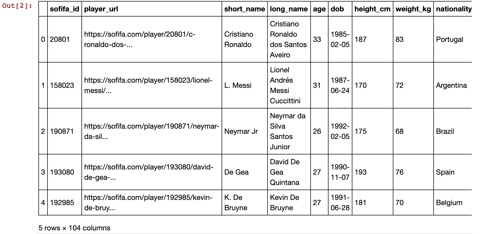
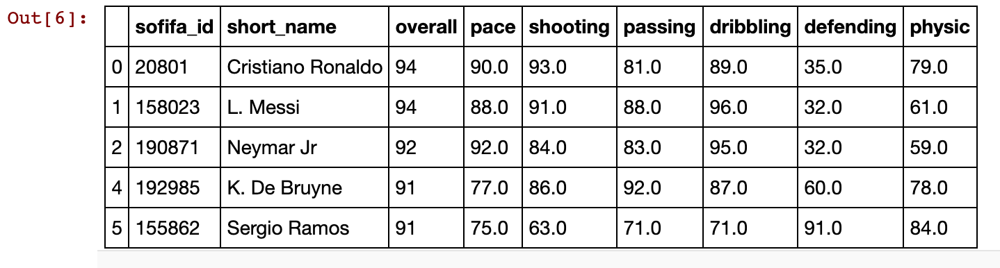
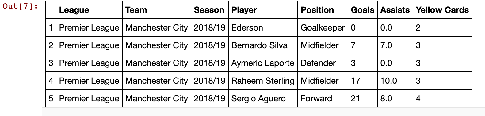
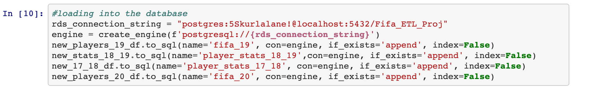
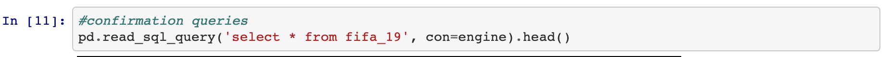

# ETL-Project

Team Significantly Different:
• Aditya
• Rosario
• Michael
• Jonathan

Project: Comparing real life season statistics of soccer players to their individual ratings in the
corresponding FIFA video game year
* **E**xtract: Below are the links of the sources from where data for the project was retrieved (CSV, JSON, pgAdmin 4, etc).

  • https://www.kaggle.com/stefanoleone992/fifa-20-complete-player-dataset (CSV)

  • https://data.world/cclayford/statbunker-football-statistics (CSV)
  
  
  
* **T**ransform: The data cleaning primarily comprised of selection of relevant columns, removing null values and changing null values to 0.\
• Only selecting the necessary columns\
• Dropping NaN values\
• Changing NaN values to 0

  
  

* **L**oad: The data was chosen to compare and analyze the real life player attribues against the FIFA video game player attributes for the years 2019 and 2020.\
  
  
• Tables\
o Joins can be used effectively to query the data to compare FIFA video game attributes to\
real life statistics
